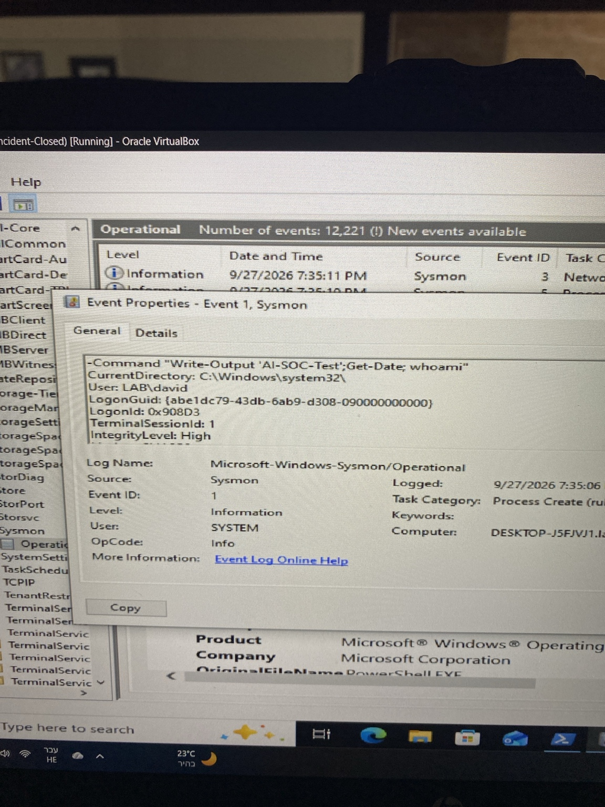
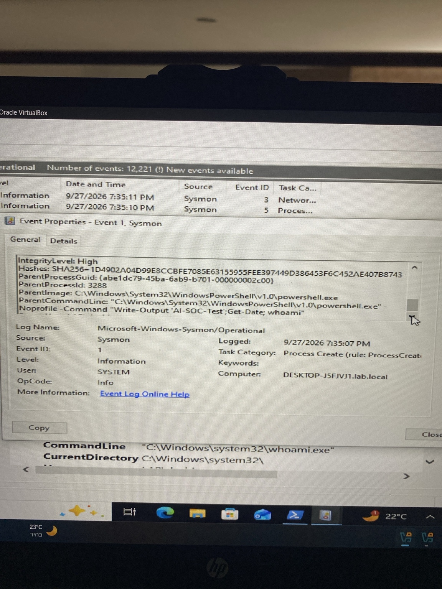
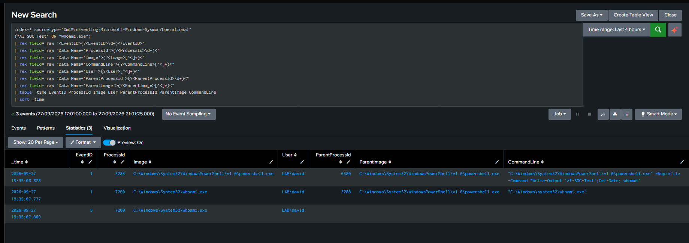
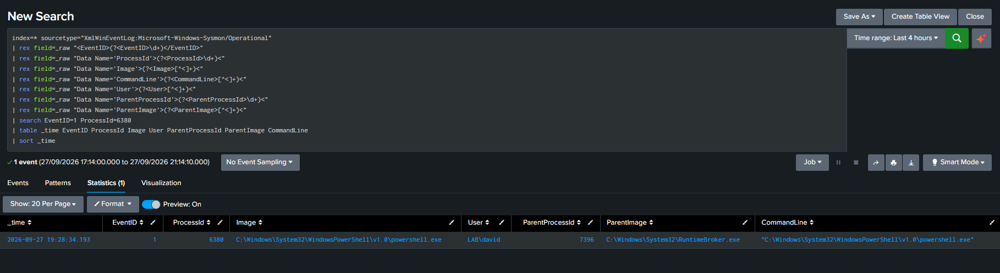
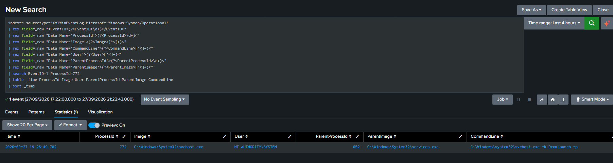
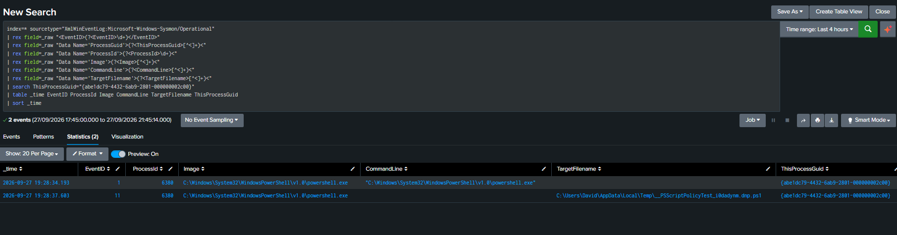
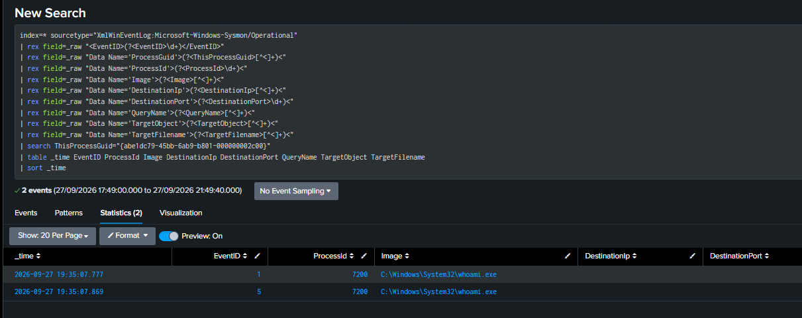

# Project 6 — AI-Assisted SOC Investigation & Human Validation

## Project Overview

This project demonstrates how Artificial Intelligence can be used as a SOC investigation copilot while keeping the human analyst responsible for validating evidence and making the final decision.

A controlled PowerShell activity was generated in a Windows 10 lab environment and investigated using Sysmon, Event Viewer, and Splunk.

The investigation was performed using two parallel approaches:

1. Traditional SOC investigation using endpoint telemetry and SIEM analysis.
2. AI-assisted investigation using an AI copilot to identify suspicious behavior, distinguish confirmed evidence from assumptions, and recommend additional investigation steps.

The AI recommendations were then manually validated in Splunk to determine whether they produced useful and accurate findings.

> **AI accelerates the investigation; the analyst validates the evidence and owns the decision.**

## Lab Environment

- Windows 10 Virtual Machine
- Sysmon
- Windows Event Viewer
- Splunk Enterprise
- Splunk Universal Forwarder
- PowerShell
- AI Copilot

## Investigation Scenario

A controlled PowerShell command was executed to generate observable endpoint activity:

```powershell
powershell.exe -NoProfile -Command "Write-Output 'AI-SOC-Test'; Get-Date; whoami"
```

The activity generated a process chain involving PowerShell and `whoami.exe`.

The investigation objective was to determine whether the activity represented malicious behavior or legitimate activity, and to compare the AI copilot's recommendations with evidence manually validated by the SOC analyst.

## Initial Evidence

The investigation began with Sysmon Event ID 1 (Process Create), which showed the following PowerShell activity:

- **Process:** `powershell.exe`
- **Process ID:** `3288`
- **User:** `LAB\david`
- **Integrity Level:** `High`
- **Parent Process ID:** `6380`
- **Parent Image:** `powershell.exe`

The command line was:

```powershell
powershell.exe -NoProfile -Command "Write-Output 'AI-SOC-Test'; Get-Date; whoami"
```

A child process was then observed:

- **Image:** `C:\Windows\System32\whoami.exe`
- **Process ID:** `7200`
- **Parent Process ID:** `3288`
- **User:** `LAB\david`

The matching parent-child relationship confirmed that `whoami.exe` was spawned by the PowerShell process under investigation.

## Process Tree

```text
services.exe
    ↓
svchost.exe -k DcomLaunch -p
PID 772
    ↓
RuntimeBroker.exe
PID 7396
    ↓
powershell.exe
PID 6380
    ↓
powershell.exe
PID 3288
    ↓
whoami.exe
PID 7200
```

The process ancestry was validated step by step in Splunk using Sysmon Process ID, Parent Process ID, ProcessGuid, and ParentProcessGuid fields.

## Additional Telemetry

Sysmon also recorded a temporary PowerShell file creation event:

- **Event ID 11 — File Create**
- **Process ID:** `3288`
- **File:** `PSScriptPolicyTest...ps1`

This temporary file was consistent with normal PowerShell execution-policy behavior and was not treated as malicious evidence by itself.

No Sysmon Event ID 3 (Network Connection) or Event ID 22 (DNS Query) associated with the investigated process was observed in the available telemetry.

## AI Copilot Analysis

The collected telemetry was then provided to an AI copilot without giving it the final investigation conclusion.

The AI was asked to answer four questions:

1. What is suspicious?
2. What is confirmed by the evidence?
3. What is not confirmed?
4. What should the analyst investigate next?

### AI Findings

The AI identified the following points:

- `PowerShell → PowerShell → whoami.exe` was potentially suspicious and required investigation.
- `whoami.exe` is a legitimate Windows utility but can also be used for user and session discovery.
- The activity was executed by `LAB\david`.
- The PowerShell process ran with a High integrity level.
- No evidence confirmed malware execution, C2 communication, payload download, credential theft, persistence, lateral movement, or exfiltration.
- The AI recommended investigating the full parent process chain, additional child processes, nearby file and registry events, DNS/network activity, and PowerShell logging.

The AI did not classify the activity as malicious based only on the available evidence.

## Human Analyst Validation

The AI recommendations were manually validated in Splunk.

### Parent Process Investigation

The analyst traced the process ancestry backward:

```text
services.exe
    ↓
svchost.exe -k DcomLaunch -p
    ↓
RuntimeBroker.exe -Embedding
    ↓
powershell.exe PID 6380
    ↓
powershell.exe PID 3288
    ↓
whoami.exe PID 7200
```

The upper process ancestry was consistent with legitimate Windows system processes.

The analyst also validated:

- `svchost.exe` was running from `C:\Windows\System32\svchost.exe`.
- The command line included `-k DcomLaunch -p`.
- The process ran as `NT AUTHORITY\SYSTEM`.
- The parent process was `services.exe`.

### Process Activity Validation

Using the Sysmon `ProcessGuid`, the analyst isolated activity belonging specifically to PowerShell PID `6380`.

Observed activity:

- Event ID 1 — Process Create
- Event ID 11 — File Create

Using `ParentProcessGuid`, the analyst identified child processes created by PID `6380`:

- `conhost.exe`
- `powershell.exe` PID `3288`
- `Sysmon.exe -c`

The `Sysmon.exe -c` process was confirmed as analyst-generated activity during the investigation.

### Network Validation

The analyst searched for network and DNS telemetry associated with the investigated process.

No matching:

- Event ID 3 — Network Connection
- Event ID 22 — DNS Query

was observed for the investigated process in the available Sysmon telemetry.

## AI vs Analyst Comparison

| Investigation Area | AI Copilot | Human Analyst Validation |
|---|---|---|
| PowerShell → PowerShell | Identified as suspicious and worth investigating | Confirmed with Sysmon Event ID 1 |
| PowerShell → whoami.exe | Identified as possible discovery behavior | Confirmed using Process ID and Parent Process ID |
| User Context | Identified `LAB\david` | Confirmed in Sysmon telemetry |
| High Integrity | Flagged as relevant context | Confirmed in Event ID 1 |
| File Creation | Recommended further review | Event ID 11 showed a temporary `PSScriptPolicyTest` file |
| Network Activity | Recommended validation | No Event ID 3 or Event ID 22 observed for the investigated process |
| Parent Process | Recommended ancestry investigation | Led to `RuntimeBroker.exe`, `svchost.exe`, and `services.exe` |
| Process Ancestry | Recommended expanding the process tree | Full lineage was manually reconstructed in Splunk |
| Malware | Did not claim malware was present | No supporting malicious telemetry was found |
| C2 Communication | Did not claim C2 activity | No supporting network telemetry was found |
| Persistence | Did not claim persistence | No supporting persistence evidence was found |
| Final Decision | Suspicious enough to investigate | Determined to be benign and authorized lab activity |

## Final Verdict

**Verdict:** Benign / Authorized Activity  
**Disposition:** False Positive

The activity initially appeared suspicious because of the following process chain:

```text
PowerShell
    ↓
PowerShell
    ↓
whoami.exe
```

However, after process ancestry analysis, command-line review, file activity validation, ProcessGuid correlation, and network/DNS checks, no supporting evidence of malicious behavior was identified.

The activity was generated intentionally as part of an authorized lab scenario.

## Lessons Learned

This project demonstrated that AI can provide meaningful value during SOC triage by:

- Highlighting suspicious process relationships.
- Separating confirmed evidence from assumptions.
- Suggesting useful investigation paths.
- Helping prioritize follow-up checks.

However, the AI did not replace analyst validation.

Every important AI recommendation was verified manually using Sysmon and Splunk telemetry before reaching the final conclusion.

> **AI can generate hypotheses and accelerate triage, but evidence must be validated by the analyst before an incident decision is made.**

## Key Takeaway

```text
Alert
   ↓
Human Investigation
   ↓
AI Hypothesis / Recommendations
   ↓
Analyst Validation in Splunk
   ↓
Evidence
   ↓
Final Verdict
```

**AI accelerates the investigation; the analyst validates the evidence and owns the decision.**

## Investigation Screenshots
### Sysmon PowerShell Event


### whoami Child Process


### Splunk Process Chain


### RuntimeBroker Parent Investigation


### svchost DCOM Launch Validation


### ProcessGuid Validation


### Network Validation

